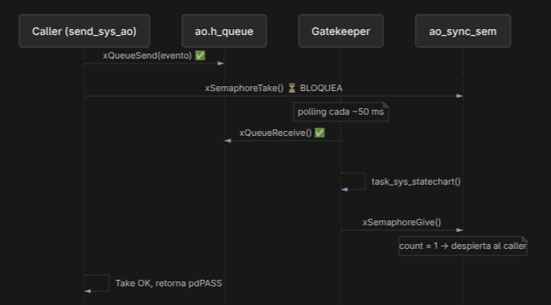

## TP2 - Actividad 02 - Active Object Sys

## Objetivo

Implementar el Active Object **Sys** como coordinador logico de la aplicacion, con API de driver, tarea gatekeeper, cola
de eventos y patron **Synchronous**.

## Diseño elegido

| Aspecto        | Implementacion                                                       |
|----------------|----------------------------------------------------------------------|
| Patron         | **Synchronous** (`xQueueSend` + `xSemaphoreTake/Give`)               |
| Gestion        | **Polling** (gatekeeper consulta colas con timeout 0 + `vTaskDelay`) |
| Almacenamiento | **Queue estatica** (`xQueueCreateStatic`)                            |
| Evento         | `sys_event_t` = `{ type, timestamp }`                                |

---

## API Active Object Sys

| Funcion            | Descripcion                                       |
|--------------------|---------------------------------------------------|
| `open_sys_ao()`    | Crea cola estatica, semaforo sync y gatekeeper    |
| `release_sys_ao()` | Libera tarea, cola y semaforo                     |
| `send_sys_ao()`    | Encola evento + tiempo y bloquea hasta ack (sync) |
| `ioctl_sys_ao()`   | Consulta estado del statechart                    |

---

## Flujo de eventos

1. Caller invoca `send_sys_ao(ao, &event)`.
2. Se encola el evento en `ao_queue`.
3. Caller bloquea en `xSemaphoreTake(ao_sync_sem)`.
4. Gatekeeper recibe el evento (polling), ejecuta statechart (run-to-completion).
5. Gatekeeper hace `xSemaphoreGive(ao_sync_sem)`.
6. Caller continua.

---

## WCET (medicion con DWT)

Variables internas en `task_sys.c` (`g_sys_ao_wcet`, static) para medir tiempos de ejecución:

| Funcion            | Variable cycles  | Variable us  |
|--------------------|------------------|--------------|
| `open_sys_ao()`    | `open_cycles`    | `open_us`    |
| `release_sys_ao()` | `release_cycles` | `release_us` |
| `send_sys_ao()`    | `send_cycles`    | `send_us`    |
| `ioctl_sys_ao()`   | `ioctl_cycles`   | `ioctl_us`   |
